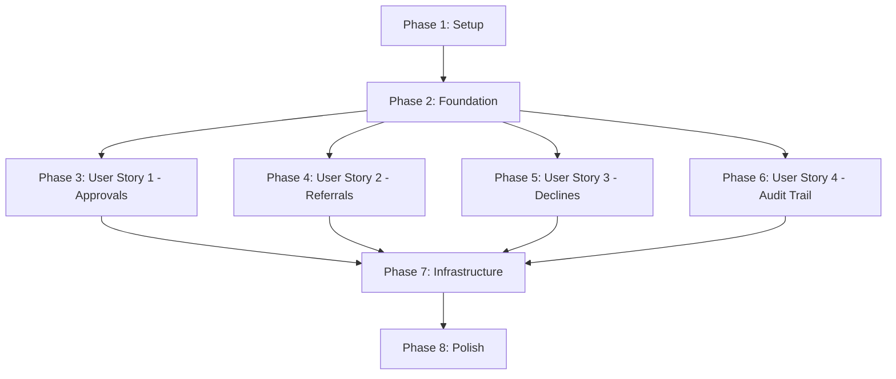

# Tasks: Credit Limit Decision Service (MVP)

**Input**: Design documents from `specs/001-credit-limit-decision/`  
**Prerequisites**: [plan.md](plan.md), [spec.md](spec.md), [research.md](research.md), [data-model.md](data-model.md), [contracts/api-contract.yaml](contracts/api-contract.yaml), [quickstart.md](quickstart.md)

**Feature**: Deterministic credit limit decision service for trade credit insurance underwriters

**Organization**: Tasks grouped by user story to enable independent implementation and testing

---

## Format: `[ID] [P?] [Story] Description`

- **[P]**: Can run in parallel (different files, no dependencies on incomplete tasks)
- **[Story]**: Which user story this task belongs to (US1, US2, US3, US4)
- All file paths are relative to repository root

---

## Phase 1: Setup (Shared Infrastructure)

**Purpose**: Project initialization and basic structure

- [X] T001 Create project directory structure (src/credit_decision/, tests/, specs/001-credit-limit-decision/)
  - **Goal**: Establish folder structure per plan.md
  - **Files to create**: Directory structure only
  - **Done when**: All directories exist as specified in plan.md project structure section
  - **Implementation notes**: Use `mkdir -p` or equivalent; no files created yet

- [X] T002 [P] Initialize Python project with requirements.txt
  - **Goal**: Set up minimal dependency management
  - **Files to create**: requirements.txt, pyproject.toml
  - **Done when**: 
    - requirements.txt contains only `boto3>=1.34.0`
    - pyproject.toml contains pytest configuration with coverage settings
  - **Implementation notes**: Per constitution principle IV (minimal dependencies), only boto3 needed; use pytest config from research.md section 6
  - **Test expectations**: N/A (configuration files)

- [X] T003 [P] Create README.md with setup and deployment instructions
  - **Goal**: Provide developer onboarding guide
  - **Files to create**: README.md (repository root)
  - **Done when**: 
    - README includes local setup commands from quickstart.md
    - README includes SAM deployment steps
    - README includes curl examples for all decision outcomes
  - **Implementation notes**: Extract content from quickstart.md sections 1-3 (Local Development, Deployment, Testing)
  - **Test expectations**: N/A (documentation)

---

## Phase 2: Foundational (Blocking Prerequisites)

**Purpose**: Core infrastructure that MUST be complete before ANY user story implementation

**⚠️ CRITICAL**: No user story work can begin until this phase is complete

- [X] T004 Define core data models in src/credit_decision/models.py
  - **Goal**: Establish type-safe data structures for all modules
  - **Files to create**: src/credit_decision/models.py
  - **Done when**:
    - `CreditDecisionRequest` dataclass with all fields from data-model.md (buyerId, policyId, requestedLimit, currency, requestId)
    - `BuyerRiskProfile` dataclass with riskGrade and pastDueOver60 (both Optional)
    - `CreditDecisionResponse` dataclass with all fields from data-model.md (decisionId, decision, approvedLimit, currency, reasonCodes, explanations, timestamp)
    - `AuditRecord` dataclass with all fields from data-model.md (decisionId, timestamp, principalId, buyerId, policyId, requestedLimit, currency, requestId, riskGrade, pastDueOver60, decision, approvedLimit, reasonCodes, status, errorCode)
    - All fields have type hints per constitution principle III
  - **Implementation notes**: Use `@dataclass` decorator from stdlib, `Optional[T]` from typing; see data-model.md for complete attribute lists
  - **Test expectations**: Models can be instantiated and serialized with dataclasses.asdict()

- [X] T005 [P] Define error types and HTTP status mapping in src/credit_decision/errors.py
  - **Goal**: Create custom exception hierarchy for error handling
  - **Files to create**: src/credit_decision/errors.py
  - **Done when**:
    - `ValidationError` exception with errorCode and message attributes (maps to HTTP 400)
    - `InternalError` exception with errorCode and message attributes (maps to HTTP 500)
    - `to_http_response()` function that converts exceptions to Lambda proxy response format
    - Error codes defined: INVALID_REQUEST, MISSING_REQUIRED_FIELD, INTERNAL_ERROR
  - **Implementation notes**: Per research.md section 5, custom exception hierarchy with HTTP status mapping; see api-contract.yaml for error response schema
  - **Test expectations**: Exceptions can be raised and converted to correct HTTP status + JSON body

- [X] T006 [P] Define reason code constants in src/credit_decision/models.py
  - **Goal**: Centralize all reason codes and explanations as constants
  - **Files to create**: Modify src/credit_decision/models.py (add constants section)
  - **Done when**:
    - Constants defined for all 7 reason codes: RISK_GRADE_HIGH, RISK_GRADE_MEDIUM, PAST_DUE_OVER_60, LIMIT_CAPPED_BY_GRADE, RISK_DATA_MISSING, PAST_DUE_DATA_MISSING
    - Mapping dict `REASON_EXPLANATIONS` with human-readable explanations for each code
    - Decision enum with values: APPROVE, REFER, DECLINE
  - **Implementation notes**: See data-model.md section "Decision Rules Table" for reason codes and explanations
  - **Test expectations**: Constants can be imported and used in decision logic

**Checkpoint**: Foundation ready - user story implementation can now begin in parallel

---

## Phase 3: User Story 1 - Automated Credit Approval for Low-Risk Buyers (Priority: P1) 🎯 MVP

**Goal**: Enable instant APPROVE decisions for Grade A/B buyers with no past-due issues, automating 60-70% of underwriter workload

**Independent Test**: Submit request with `riskGrade: "A"`, `pastDueOver60: false`, `requestedLimit: 500000` → System returns `decision: "APPROVE"`, `approvedLimit: 500000`

### Implementation for User Story 1

- [X] T007 [P] [US1] Implement pure decision engine in src/credit_decision/decision_engine.py
  - **Goal**: Create deterministic rule evaluation function
  - **Files to create**: src/credit_decision/decision_engine.py
  - **Done when**:
    - Function signature: `evaluate_decision(request: CreditDecisionRequest, risk_profile: BuyerRiskProfile) -> CreditDecisionResponse`
    - Implements all 7 decision rules from data-model.md in fixed order
    - Returns decision, approvedLimit, reasonCodes, explanations
    - Function is pure (no I/O, no AWS SDK calls, no random, no timestamps)
    - Handles capping logic: Grade A max 1M, Grade B max 500K
  - **Implementation notes**: Per constitution principle I (NON-NEGOTIABLE), must be pure function; see data-model.md "Decision Rules Table" for complete rule matrix; generate decisionId and timestamp in handler, not here
  - **Test expectations**: 
    - AC-1: Grade D/E → DECLINE
    - AC-4: Grade A + no past due, limit ≤1M → APPROVE
    - AC-5: Grade A + no past due, limit >1M → APPROVE (capped with reason)
    - AC-6: Grade B + no past due, limit ≤500K → APPROVE
    - AC-7: Grade B + no past due, limit >500K → APPROVE (capped with reason)
    - AC-23: Determinism test (identical inputs → identical outputs)

- [X] T008 [P] [US1] Implement unit tests for decision engine in tests/test_decision_engine.py
  - **Goal**: Validate all 7 decision rules with parameterized tests
  - **Files to create**: tests/test_decision_engine.py
  - **Done when**:
    - Parameterized test for all Grade A approval scenarios (AC-4, AC-5)
    - Parameterized test for all Grade B approval scenarios (AC-6, AC-7)
    - Determinism test: same inputs called twice produce same reasonCodes/decision (AC-23)
    - Coverage >90% for decision_engine.py
  - **Implementation notes**: Use `@pytest.mark.parametrize` per research.md section 6; create test fixtures for different risk profiles; verify capping logic and reason codes
  - **Test expectations**: All tests pass; pytest output shows 9+ test cases for User Story 1 acceptance criteria

- [X] T009 [US1] Implement stub data sources in src/credit_decision/data_sources.py
  - **Goal**: Provide in-memory risk data lookup for MVP
  - **Files to create**: src/credit_decision/data_sources.py
  - **Done when**:
    - `RiskDataSource` Protocol defined with `get_risk_profile(buyer_id: str, policy_id: str) -> BuyerRiskProfile`
    - `InMemoryRiskDataSource` implementation with pre-configured test buyers (Grade A, B, C, D, E, missing data)
    - At least 10 test buyers configured for different scenarios
  - **Implementation notes**: Per research.md section 4, use typing.Protocol for interface; in-memory dict with keys like "BYR-12345"; see quickstart.md for example test data
  - **Test expectations**: Can retrieve risk profiles for known buyers; unknown buyers return None for riskGrade/pastDueOver60

**Checkpoint**: At this point, User Story 1 decision logic should be fully functional and testable independently (approval rules work)

---

## Phase 4: User Story 2 - Automatic Referral for Medium-Risk Cases (Priority: P2)

**Goal**: Enable instant REFER decisions for Grade C, missing data, or past-due buyers to ensure human oversight for risky cases

**Independent Test**: Submit request with `riskGrade: "C"` → System returns `decision: "REFER"`, `approvedLimit: 0`, reason code "RISK_GRADE_MEDIUM"

### Implementation for User Story 2

- [X] T010 [P] [US2] Add referral rules to decision engine in src/credit_decision/decision_engine.py
  - **Goal**: Implement rules 2, 3, 6, 7 for REFER outcomes
  - **Files to modify**: src/credit_decision/decision_engine.py
  - **Done when**:
    - Rule 2: Grade C → REFER with "RISK_GRADE_MEDIUM"
    - Rule 3: Grade A/B + pastDueOver60=true → REFER with "PAST_DUE_OVER_60"
    - Rule 6: Missing riskGrade → REFER with "RISK_DATA_MISSING"
    - Rule 7: Missing pastDueOver60 → REFER with "PAST_DUE_DATA_MISSING"
    - approvedLimit always 0 for REFER
  - **Implementation notes**: Add to existing evaluate_decision function; rules must be checked in order 1-7 per spec determinism requirement
  - **Test expectations**:
    - AC-2: Grade C → REFER
    - AC-3: Grade A/B + past due → REFER
    - AC-8: Missing risk grade → REFER
    - AC-9: Missing past due data → REFER

- [X] T011 [P] [US2] Add referral test cases to tests/test_decision_engine.py
  - **Goal**: Validate all 4 referral scenarios
  - **Files to modify**: tests/test_decision_engine.py
  - **Done when**:
    - Parameterized test for all REFER scenarios (Grade C, past due, missing data)
    - Tests verify approvedLimit=0 and correct reason codes
  - **Implementation notes**: Add new test cases to existing file; use pytest.mark.parametrize for the 4 referral scenarios from User Story 2 acceptance criteria
  - **Test expectations**: All 4 referral tests pass; coverage remains >90%

**Checkpoint**: At this point, User Story 2 should be fully functional (referral rules work independently)

---

## Phase 5: User Story 3 - Automatic Decline for High-Risk Buyers (Priority: P3)

**Goal**: Enable instant DECLINE decisions for Grade D/E buyers to save underwriter time on obvious rejections

**Independent Test**: Submit request with `riskGrade: "D"` → System returns `decision: "DECLINE"`, `approvedLimit: 0`, reason code "RISK_GRADE_HIGH"

### Implementation for User Story 3

- [X] T012 [P] [US3] Add decline rule to decision engine in src/credit_decision/decision_engine.py
  - **Goal**: Implement rule 1 for DECLINE outcomes
  - **Files to modify**: src/credit_decision/decision_engine.py
  - **Done when**:
    - Rule 1: Grade D or E → DECLINE with "RISK_GRADE_HIGH"
    - approvedLimit always 0 for DECLINE
  - **Implementation notes**: Add to existing evaluate_decision function as first rule check (highest priority per spec); see data-model.md decision rules table
  - **Test expectations**:
    - AC-1: Grade D/E → DECLINE

- [X] T013 [P] [US3] Add decline test cases to tests/test_decision_engine.py
  - **Goal**: Validate decline scenarios for high-risk buyers
  - **Files to modify**: tests/test_decision_engine.py
  - **Done when**:
    - Test case for Grade D → DECLINE
    - Test case for Grade E → DECLINE
    - Tests verify approvedLimit=0 and "RISK_GRADE_HIGH" reason code
  - **Implementation notes**: Add 2 test cases (one for D, one for E) to existing parameterized test
  - **Test expectations**: Both decline tests pass; coverage remains >90%

**Checkpoint**: At this point, User Story 3 should be fully functional (all decision outcomes work: APPROVE, REFER, DECLINE)

---

## Phase 6: User Story 4 - Complete Audit Trail for Compliance (Priority: P1)

**Goal**: Ensure every credit decision request (successful or failed) writes an immutable audit record to DynamoDB for regulatory compliance

**Independent Test**: Submit a decision request and verify DynamoDB audit table contains record with decisionId, all inputs, outputs, timestamp, principalId, and status "OK"

### Implementation for User Story 4

- [X] T014 [P] [US4] Implement DynamoDB audit writer in src/credit_decision/audit_repo.py
  - **Goal**: Write audit records to DynamoDB table
  - **Files to create**: src/credit_decision/audit_repo.py
  - **Done when**:
    - Function signature: `write_audit_record(record: AuditRecord) -> None`
    - Uses boto3 DynamoDB client to PutItem
    - Partition key: `pk = "DECISION#{decisionId}"`
    - All AuditRecord fields serialized to DynamoDB item
    - Table name from environment variable: AUDIT_TABLE_NAME
    - No error handling for DynamoDB failures (eventual consistency per spec edge case)
  - **Implementation notes**: Per research.md section 3, partition key pattern is `DECISION#{decisionId}`; use boto3 dynamodb client, not resource; see data-model.md for AuditRecord schema
  - **Test expectations**:
    - AC-15: Successful decision → audit record with status "OK"
    - AC-16: Validation error → audit record with status "FAILED"
    - Can mock DynamoDB client to verify PutItem called with correct attributes

- [X] T015 [US4] Implement Lambda handler with request orchestration in src/credit_decision/handler.py
  - **Goal**: Create API Gateway Lambda proxy integration entrypoint
  - **Files to create**: src/credit_decision/handler.py
  - **Done when**:
    - Function signature: `lambda_handler(event, context) -> dict`
    - Parses JSON body from event['body'] into CreditDecisionRequest
    - Validates request (see AC-10 through AC-14)
    - Calls data_sources to get BuyerRiskProfile
    - Calls decision_engine.evaluate_decision()
    - Generates decisionId (UUID v4) and timestamp (ISO 8601 UTC)
    - Calls audit_repo.write_audit_record() for both success and failure cases
    - Returns Lambda proxy response: `{"statusCode": 200, "headers": {"Content-Type": "application/json"}, "body": "<JSON>"}`
    - Extracts principalId from event['requestContext']['authorizer']['principalId'], defaults to "anonymous"
    - Structured logging with decisionId in all log entries
  - **Implementation notes**: Per research.md section 2, use Lambda proxy integration response format; see api-contract.yaml for request/response schemas; per research.md section 8, use json.dumps() for structured logging
  - **Test expectations**:
    - AC-10 through AC-14: All validation errors return HTTP 400
    - AC-17: principalId extracted from authorizer context
    - AC-18: principalId = "anonymous" when authorizer absent
    - AC-19: Success response HTTP 200 with all fields
    - AC-20: Validation error HTTP 400 with errorCode/message
    - AC-21: Internal error HTTP 500 with errorCode/message
    - AC-22: All responses have Content-Type: application/json
    - AC-24: Logs include decisionId
    - AC-25: Logs are structured JSON

- [X] T016 [P] [US4] Implement request validation tests in tests/test_handler_validation.py
  - **Goal**: Validate all request validation error cases
  - **Files to create**: tests/test_handler_validation.py
  - **Done when**:
    - Test case: Missing buyerId → HTTP 400 with "MISSING_REQUIRED_FIELD" (AC-10)
    - Test case: Missing policyId → HTTP 400 with "MISSING_REQUIRED_FIELD" (AC-11)
    - Test case: requestedLimit ≤ 0 → HTTP 400 with "INVALID_REQUEST" (AC-12)
    - Test case: Decimal requestedLimit → HTTP 400 with "INVALID_REQUEST" (AC-13)
    - Test case: Invalid currency format → HTTP 400 with "INVALID_REQUEST" (AC-14)
    - Test case: Error response format check (JSON with errorCode and message) (AC-20)
  - **Implementation notes**: Mock event structure per Lambda proxy integration; verify HTTP status code and JSON error response schema
  - **Test expectations**: All 6 validation tests pass; each test verifies HTTP 400 status and correct error code

- [X] T017 [P] [US4] Implement end-to-end integration tests in tests/test_integration.py
  - **Goal**: Validate complete handler orchestration with audit
  - **Files to create**: tests/test_integration.py
  - **Done when**:
    - Test case: Successful decision → HTTP 200 + audit record with status "OK" (AC-15, AC-19)
    - Test case: Validation failure → audit record with status "FAILED" (AC-16)
    - Test case: principalId from authorizer context (AC-17)
    - Test case: principalId = "anonymous" when no authorizer (AC-18)
    - Test case: Internal error → HTTP 500 (AC-21)
    - Test case: All responses have Content-Type: application/json (AC-22)
    - Test case: Logs include decisionId (AC-24)
    - Test case: Logs are structured JSON (AC-25)
  - **Implementation notes**: Mock DynamoDB client; mock data_sources; use caplog fixture for log verification; construct full Lambda event structure with/without authorizer
  - **Test expectations**: All 8 integration tests pass; coverage >80% overall

**Checkpoint**: At this point, User Story 4 should be fully functional (complete audit trail with handler orchestration)

---

## Phase 7: Infrastructure & Deployment

**Purpose**: AWS SAM template and deployment configuration

- [X] T018 Create SAM template in template.yaml
  - **Goal**: Define Lambda function, API Gateway, DynamoDB table, and IAM permissions
  - **Files to create**: template.yaml (repository root)
  - **Done when**:
    - `AWS::Serverless::Function` resource: Python 3.13 runtime, handler=src.credit_decision.handler.lambda_handler
    - `AWS::Serverless::HttpApi` resource with POST /credit-decisions route (Lambda proxy integration)
    - `AWS::DynamoDB::Table` resource: CreditDecisionAudit table, partition key "pk" (String), on-demand billing
    - Environment variable: AUDIT_TABLE_NAME = !Ref CreditDecisionAuditTable
    - IAM policy: DynamoDB PutItem permission for audit table only (per plan.md IAM section)
    - CloudWatch Logs permissions for Lambda
  - **Implementation notes**: Per research.md section 7, use SAM syntax; see plan.md "IAM Permissions (Minimal)" section for exact policy; per research.md section 3, use on-demand billing mode for DynamoDB
  - **Test expectations**: 
    - `sam validate` passes
    - `sam build` succeeds
    - `sam local start-api` starts successfully

- [X] T019 [P] Add deployment scripts and local testing documentation to README.md
  - **Goal**: Enable developers to deploy and test locally
  - **Files to modify**: README.md
  - **Done when**:
    - README includes `sam build`, `sam deploy --guided` commands
    - README includes `sam local start-api` for local testing
    - README includes curl examples for all 3 decision outcomes (APPROVE, REFER, DECLINE)
    - README includes validation error example (missing buyerId)
  - **Implementation notes**: Extract from quickstart.md sections 2-3; add examples from api-contract.yaml
  - **Test expectations**: Developer can follow README to deploy and test

**Checkpoint**: At this point, service can be deployed to AWS and tested locally

---

## Phase 8: Polish & Cross-Cutting Concerns

**Purpose**: Final touches for production readiness

- [X] T020 [P] Add structured logging helper in src/credit_decision/handler.py
  - **Goal**: Ensure all logs are JSON formatted with decisionId
  - **Files to modify**: src/credit_decision/handler.py
  - **Done when**:
    - Helper function: `log_structured(decision_id: str, level: str, message: str, **kwargs) -> None`
    - Logs formatted as JSON with fields: timestamp, level, decisionId, message, and any kwargs
    - All handler log statements use this helper
  - **Implementation notes**: Per research.md section 8, use json.dumps() for structured logging; constitution principle V requires decisionId in all logs
  - **Test expectations**: AC-24, AC-25 pass (logs include decisionId and are JSON formatted)

- [X] T021 [P] Add input validation helper in src/credit_decision/handler.py
  - **Goal**: Centralize request validation logic
  - **Files to modify**: src/credit_decision/handler.py
  - **Done when**:
    - Helper function: `validate_request(data: dict) -> CreditDecisionRequest`
    - Validates all required fields (buyerId, policyId, requestedLimit, currency)
    - Validates requestedLimit is positive integer (no decimals)
    - Validates currency is 3-letter uppercase string
    - Raises ValidationError with appropriate errorCode and message
    - Returns validated CreditDecisionRequest dataclass
  - **Implementation notes**: See data-model.md validation rules; use regex for currency: `^[A-Z]{3}$`; check isinstance(requestedLimit, int) and requestedLimit > 0
  - **Test expectations**: AC-10 through AC-14 pass (all validation errors caught and returned as HTTP 400)

- [ ] T022 [P] Add type checking and linting configuration
  - **Goal**: Enable static type checking and code quality tools
  - **Files to create/modify**: pyproject.toml, .gitignore
  - **Done when**:
    - pyproject.toml includes mypy configuration with strict mode
    - pyproject.toml includes black configuration
    - .gitignore includes Python artifacts (__pycache__, *.pyc, .pytest_cache, htmlcov/)
    - All source files pass `mypy src/` with no errors
    - All source files pass `black --check src/`
  - **Implementation notes**: Constitution principle VII requires black-compatible formatting and type hints; use mypy for type checking
  - **Test expectations**: `mypy src/` returns 0 errors; `black --check src/ tests/` returns 0 changes needed

- [X] T023 Run full test suite and verify coverage targets
  - **Goal**: Ensure all acceptance criteria pass and coverage meets targets
  - **Files to verify**: All test files
  - **Done when**:
    - `pytest` passes with 0 failures
    - `pytest --cov` shows >90% coverage for decision_engine.py
    - `pytest --cov` shows >80% overall coverage
    - All 25 acceptance criteria have corresponding passing tests
  - **Implementation notes**: Run `pytest -v --cov=src/credit_decision --cov-report=html`; review htmlcov/index.html for coverage gaps; see plan.md acceptance criteria mapping table for all 25 criteria
  - **Test expectations**: Test report shows all 25 AC tests passing; coverage report meets targets

---

## Dependencies & Parallel Execution

### User Story Completion Order

### Parallel Execution Opportunities

**Within Phase 2 (Foundation)**:
- T005 (errors.py) can run parallel with T004 (models.py)
- T006 (reason codes) depends on T004 (models.py) but can run parallel with T005

**Across User Stories** (after Phase 2 complete):
- **User Story 1** (T007-T009): Can implement in parallel with US2, US3, US4
- **User Story 2** (T010-T011): Can implement in parallel with US1, US3, US4
- **User Story 3** (T012-T013): Can implement in parallel with US1, US2, US4
- **User Story 4** (T014-T017): Can implement in parallel with US1, US2, US3

**Within User Story 1**:
- T007 (decision_engine.py) and T008 (tests) can be done in parallel (TDD approach)
- T009 (data_sources.py) can run parallel with T007 and T008

**Within User Story 4**:
- T014 (audit_repo.py) can run parallel with T015 (handler.py) initially, but T015 depends on T014 completion for integration
- T016 (validation tests) can run parallel with T017 (integration tests)

**Phase 7 (Infrastructure)**:
- T018 (template.yaml) can run parallel with T019 (README updates)

**Phase 8 (Polish)**:
- T020 (logging helper), T021 (validation helper), T022 (type checking) can all run in parallel
- T023 (full test suite) must run after all other tasks complete

### Recommended Parallel Batches

**Batch 1** (Setup): T001, T002, T003 (can all run together)

**Batch 2** (Foundation): T004, T005 (parallel), then T006

**Batch 3** (Core Logic - after Foundation):
- Developer A: T007, T008 (User Story 1 - decision engine + tests)
- Developer B: T010, T011 (User Story 2 - referrals)
- Developer C: T012, T013 (User Story 3 - declines)
- Developer D: T009 (User Story 1 - data sources), T014 (User Story 4 - audit repo)

**Batch 4** (Handler & Tests - after Batch 3):
- Developer A: T015 (handler.py - depends on all previous)
- Developer B: T016 (validation tests)
- Developer C: T017 (integration tests)

**Batch 5** (Infrastructure - after Batch 4): T018, T019 (parallel)

**Batch 6** (Polish - after Batch 5): T020, T021, T022 (parallel)

**Batch 7** (Verification - after Batch 6): T023 (sequential)

---

## Implementation Strategy

### MVP Definition (Minimal Viable Product)

**Recommended MVP Scope**: Complete all phases through Phase 6 (User Stories 1-4)

**Why**: All 4 user stories are interconnected through shared decision engine. User Story 1 (P1 - Approvals) and User Story 4 (P1 - Audit) are both priority 1 and non-negotiable. User Stories 2 and 3 add REFER and DECLINE outcomes which are part of the same decision function.

**MVP Deliverables**:
- ✅ All 7 decision rules implemented in decision_engine.py
- ✅ All 3 decision outcomes: APPROVE, REFER, DECLINE
- ✅ Complete audit trail for compliance
- ✅ Lambda handler with full validation and error handling
- ✅ 25/25 acceptance criteria tests passing
- ✅ SAM template for deployment

### Incremental Delivery Beyond MVP

**Post-MVP Enhancements** (if MVP is redefined as smaller):
1. **Phase 8 Polish**: Structured logging helpers, type checking, linting (improves maintainability)
2. **Idempotency**: Implement requestId deduplication (currently out of scope per spec)
3. **Audit Querying**: Add read API for audit records (currently write-only)
4. **Real Data Sources**: Swap in-memory stubs for real risk data integration

**Cannot Reduce MVP Scope** because:
- Constitution principle I (NON-NEGOTIABLE): Decision logic must be pure and deterministic → requires all rules
- Constitution principle II (NON-NEGOTIABLE): Audit trail mandatory → User Story 4 required
- User Stories 1-3 all use same decision engine → cannot split approval/referral/decline

---

## Summary

**Total Tasks**: 23 tasks (T001-T023)

**Task Count by User Story**:
- Setup (Phase 1): 3 tasks
- Foundation (Phase 2): 3 tasks
- User Story 1 (P1 - Approvals): 3 tasks (T007-T009)
- User Story 2 (P2 - Referrals): 2 tasks (T010-T011)
- User Story 3 (P3 - Declines): 2 tasks (T012-T013)
- User Story 4 (P1 - Audit Trail): 4 tasks (T014-T017)
- Infrastructure (Phase 7): 2 tasks (T018-T019)
- Polish (Phase 8): 4 tasks (T020-T023)

**Parallel Opportunities Identified**: 15+ tasks can run in parallel across 7 batches

**Independent Test Criteria by Story**:
- ✅ **US1**: Submit Grade A request → get APPROVE response
- ✅ **US2**: Submit Grade C request → get REFER response
- ✅ **US3**: Submit Grade D request → get DECLINE response
- ✅ **US4**: Submit any request → verify DynamoDB audit record exists

**Estimated Timeline** (with parallelization):
- **Batch 1** (Setup): 2 hours
- **Batch 2** (Foundation): 3 hours
- **Batch 3** (Core Logic): 6 hours (parallel: 2-3 hours wall time)
- **Batch 4** (Handler): 8 hours (parallel: 3-4 hours wall time)
- **Batch 5** (Infrastructure): 4 hours (parallel: 2 hours wall time)
- **Batch 6** (Polish): 4 hours (parallel: 2 hours wall time)
- **Batch 7** (Verification): 2 hours
- **Total Sequential**: 29 hours
- **Total Parallel** (4 developers): ~14-16 hours wall time

**Coverage Targets**:
- decision_engine.py: >90% (25 acceptance criteria)
- Overall: >80%

**All Tasks Follow Checklist Format**: ✅ Yes - every task has checkbox, ID, [P] marker (if parallelizable), [Story] label (for user story phases), and exact file path

---

**Next Steps**:
1. Review tasks with team
2. Assign tasks to developers (consider parallel batches)
3. Begin with Phase 1 (Setup) and Phase 2 (Foundation)
4. Implement User Stories in parallel after foundation complete
5. Run full test suite (T023) to verify all 25 acceptance criteria pass
